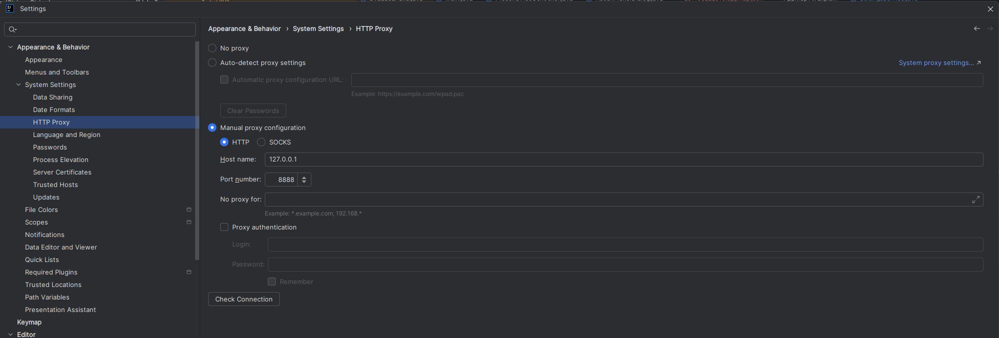

# Local MITM Proxy für GitHub Copilot & OpenAI

Dieses Projekt stellt einen lokalen HTTP/HTTPS-Proxy mit optionaler MITM-Funktionalität bereit, um den Traffic zu `api.openai.com` zu analysieren und gezielt zu modifizieren – insbesondere für GitHub Copilot mit eigenem OpenAI-API-Key.

Ziel:
Debuggen, Verstehen und ggf. Umschreiben von Requests (z. B. `temperature`-Fix für `gpt-5-mini`), **ohne** Copilot-Plugin-Code zu patchen.

**Wichtige Hinweise vorneweg**

- Dieser Proxy ist ausschließlich für den **lokalen, privaten Gebrauch zu Debugging-Zwecken** gedacht.
- MITM von TLS-Verbindungen ist sicherheitskritisch:
  - Nur eigene Maschinen verwenden.
  - Nur eigene Keys verwenden.
  - CA-Zertifikat wieder aus dem System entfernen, wenn es nicht mehr benötigt wird.
- Der Proxy ist generisch aufgebaut, die OpenAI-/Copilot-spezifischen Anpassungen sind klar gekapselt.

---

## Features im Überblick

### 1. Lokaler HTTP/HTTPS-Proxy

- Implementiert in Java 8.
- Unterstützt:
  - Normale HTTP-Requests.
  - `CONNECT`-Tunnels für HTTPS (ohne MITM einfach durchgereicht).
- Start/Stop über eine Swing-UI (`ProxyControlFrame`).
- Standardport konfigurierbar (z. B. `127.0.0.1:8888`).

### 2. Optionale MITM-Unterstützung (standardmäßig `api.openai.com`)

- Aktivierung über Checkbox in der UI:
  **"Enable MITM for api.openai.com"**
- Technisch:
  - Für `CONNECT api.openai.com:443` wird ein TLS-MITTELMANN aufgebaut:
    - Client ↔ Proxy (mit lokalem Zertifikat für `api.openai.com`)
    - Proxy ↔ echtes `api.openai.com`
  - Der Proxy kann so TLS-Payload lesen, loggen und gezielt anpassen.
- Die MITM-Funktionalität ist gekapselt:
  - `MitmHandler`
  - `GenericMitmHandler`
  - Angesteuert von `LocalProxyServer` / `ProxyConnectionHandler`.

### 3. Copilot + OpenAI-spezifische Anpassungen

Aktueller Hauptanwendungsfall:

- GitHub Copilot spricht gegen `api.openai.com` mit eigenem OpenAI-API-Key.
- Für einige Modelle (z. B. `gpt-5-mini`) ist `temperature = 0.0` nicht erlaubt.
- Der Proxy erkennt entsprechende Requests und passt nur das Notwendige an, ohne das restliche Payload zu zerstören.

Implementierungsprinzip:

- Nur Requests auf `/v1/chat/completions` mit bestimmten Modellen anpassen.
- JSON-Body minimal-invasiv modifizieren (z. B. `temperature: 0.0` → `1.0`), idealerweise mit Längen- oder Feldanpassung, sodass die API die Anfrage akzeptiert.
- Alle Änderungen sind im MITM-Handler gekapselt und können erweitert oder deaktiviert werden.

(Die Modellwahl wird perspektivisch über die UI konfigurierbar gemacht.)

---

## UI: `ProxyControlFrame`

Die UI steuert den Proxy und bindet Logging und Skriptintegration ein.

### Kernfunktionen

- Port-Konfiguration.
- Anzeige:
  - Proxy-Status (`running` / `stopped`).
  - Hinweis: `Use as HTTP proxy: 127.0.0.1:<port>`.
- Keystore-Pfad für MITM:
  - Textfeld.
  - „Browse…“-Button.
  - Default: `~/.proxy/myproxy.jks`.
- Checkbox:
  - `Enable MITM for api.openai.com`.
- Buttons:
  - **Start proxy** / **Stop proxy**
  - **Apply settings**
  - **Generate MITM keystore**
  - **Install CA into system trust store**

### Traffic-Logging

- `JTextPane` im HTML-Modus.
- Einträge mit Präfix:
  - `[info]`, `[setup]`, `[client->server headers]`, `[client->server body]`, `[client->server body (modified)]`, `[server->client]` etc.
- JSON-Bodies werden mit Gson formatiert, wenn möglich.
- Dient zum Nachvollziehen:
  - Welche Requests Copilot sendet.
  - Wie der Proxy diese weiterleitet oder modifiziert.

---

## Konfiguration & Persistenz

Konfigurationsdatei:

```text
~/.proxy/proxy.properties
```

Schlüssel:

- `proxy.port` – Port des lokalen Proxys.
- `proxy.keystore.path` – Pfad zum MITM-Keystore (`myproxy.jks`).
- `proxy.mitm.enabled` – `true` / `false`.

Die UI lädt diese Werte beim Start und speichert sie bei „Apply settings“.

---

## PowerShell-Skripte & Zertifikate

### Ressourcenstruktur

Die Skripte werden als Ressourcen eingebunden:

```text
src/main/resources/ps/create-ca.ps1
src/main/resources/ps/create-openai-cert.ps1
(optional) src/main/resources/ps/install-ca.ps1
```

Im JAR liegen sie entsprechend unter `/ps/...` und werden per
`ProxyControlFrame.class.getResourceAsStream(...)` geladen.

### „Generate MITM keystore“

Button-Ablauf:

1. Warn-/Bestätigungsdialog:
   - Es wird eine lokale CA und ein Zertifikat für `api.openai.com` erzeugt.
   - Ablage unter `~/.proxy`.
   - Nur für lokales Debugging.
2. Nach Bestätigung:
   - Skripte aus Ressourcen nach `~/.proxy` extrahieren:
     - `create-ca.ps1`
     - `create-openai-cert.ps1`
   - Ausführung über:
     ```powershell
     powershell.exe -ExecutionPolicy Bypass -File create-ca.ps1
     powershell.exe -ExecutionPolicy Bypass -File create-openai-cert.ps1
     ```
   - Output im UI-Log anzeigen.
   - Erwartete Dateien:
     - `~/.proxy/myproxy-ca.crt`
     - `~/.proxy/myproxy.jks`
   - Bei Erfolg:
     - Keystore-Pfad in UI setzen.
     - MITM-Checkbox aktivieren.
     - Konfiguration speichern.

Wichtig:
Dieser Schritt installiert **kein** Zertifikat automatisch im System-Trust-Store.

---

## „Install CA into system trust store“

Separater Button mit deutlicher Belehrung.

Vorgehen (Windows):

1. Prüft, ob `~/.proxy/myproxy-ca.crt` existiert.
2. Zeigt Warn-Dialog:

   - CA wird in „Trusted Root Certification Authorities“ importiert.
   - Führt dazu, dass durch diesen Proxy ausgestellte Zertifikate (z. B. `api.openai.com`) als vertrauenswürdig gelten.
   - Nur auf eigener Dev-Maschine nutzen.
   - Nach Gebrauch wieder entfernen.

3. Bei Bestätigung:
   - Führt aus:
     ```cmd
     certutil -addstore -f Root myproxy-ca.crt
     ```
   - Loggt Ausgabe und zeigt Erfolg/Fehler im UI.

Hinweise:

- Für diesen Schritt sind in der Regel Adminrechte erforderlich.
- Der Import erfolgt niemals „silent“, sondern nur nach expliziter Zustimmung.

---

## Typischer Workflow

1. Projekt bauen (Gradle).
2. Anwendung starten (`ProxyControlFrame`).
3. In IntelliJ IDEA den HTTP-Proxy auf den lokalen Proxy setzen:

   

    - `Manual proxy configuration`
    - `HTTP`
    - Host name: `127.0.0.1`
    - Port number: `8888` (oder dein konfigurierter Port)
4. Optional:
   - „Generate MITM keystore“ ausführen, um `myproxy.jks` zu erzeugen.
   - Nur bei Bedarf: „Install CA into system trust store“ ausführen.
5. Proxy starten.
6. Copilot/OpenAI verwenden:
   - Requests und Responses im UI einsehbar.
   - MITM aktiv, wenn konfiguriert.

---

## Sicherheit

- CA im Root-Store ist eine Hochrisiko-Operation:
  - Nur auf kontrollierten Systemen.
  - CA nach Gebrauch entfernen.
- Der Proxy ist so implementiert, dass:
  - MITM explizit aktiviert werden muss.
  - Zielhost klar eingeschränkt ist.
  - Skripte und Zertifikatsoperationen transparent und nachvollziehbar sind.

---

## Erweiterungen (Ausblick)

Geplante/naheliegende Erweiterungen:

- Auswahl des Zielmodells in der UI:
  - z. B. Mapping von `gpt-5-mini` → anderes Modell.
  - Konfigurierbare Regeln pro Modell.
- Feinere Regel-Engine für JSON-Rewrites.
- Export/Import von Proxy-Regeln.

Die aktuelle Architektur (UI → Proxy-Service → MITM-Handler) ist bewusst so ausgelegt, dass diese Erweiterungen sauber ergänzt werden können.

---

## Entwicklerinformationen
### Automatische Proxy-Konfiguration per WPAD/PAC-Datei
Wenn unter Windows ein Setupskript mit URL für das Netzwerk hinterlegt ist, muss das Projekt wie folgt über die PowerShell gebaut werden:

```
./gradlew assemble --init-script proxy-init.gradle
```

Dadurch werden die nötigen Dependencies in den Gradle-Cache geladen. Anschließen kann das Projekt auch einfach wie gewohnt in IntelliJ gestartet und dedebugged werden. Dazu einfach die Play-Taste neben der main anklicken. Bei Änderungen der Dependencies muss der o.g. Befehl im Terminal allerdings immer wieder erneut ausgeführt werden.

**Tipp:** Wer sich das wiederholte Ausführen im Terminal sparen möchte, kann die Datei `proxy-init.gradle` auch global unter `%USERPROFILE%\.gradle\init.gradle` ablegen. Damit wird die automatische Proxy-Konfiguration dauerhaft für alle Gradle-Projekte übernommen – unabhängig davon, wie sie gestartet werden. (Die Datei muss zwingend in init.gradle umbenannt werden, ansonsten funktioniert es nicht.)

### Proxy-Konfiguration für GIT-Versionsverwaltung
Da GIT analog zu Gradle die Proxy Konfiguration aus Windows nicht automatisch übernimmt, muss einmalig für dem ersten Push folgendes Script ausgeführt werden:
```
.\configure-git-proxy.ps1
```
Hierbei wird ein minimalistischer JavaScript Parser verwendet, um an die notwendigen Informationen aus der PAC-Datei zu gelangen.

### Proxy-Konfiguration für IDEA (funktioniert aber nicht für Gradle und GIT)
Im obigen Fall muss auch IDEA angepasst werden, damit die GIT-Versionsverwaltung wie gewohnt funktioniert. Das geht am einfachsten wie folgt:
Settings → Appearance & Behavior → System Settings → HTTP Proxy:
- steht auf Auto-detect proxy settings
- oder manuell mit den richtigen Daten (falls "auto" nicht ausreicht die Box für den Link anhaken)
  Die URL für die halbautomatische Einstellung bekommt man über ein Klick auf den blauen Link zu den Systemeinstellugen, die URL dort einfach kopieren.
